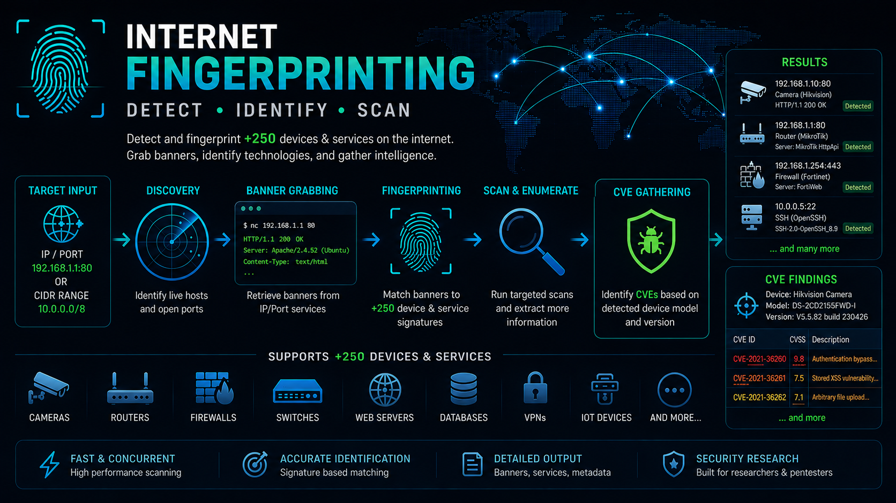

# ZSPURE
<div align="center">

</div>

**zspure** is a tool for gathering information from the devices or services on the internet. It supports +250 devices/services fingerprints and +15 protocols to get banner.

# How to run
For install and run this tool you have to follow this structure :
```sh
git clone https://github.com/gopy-art/zspure.git
cd zspure
go build
```

the base on your use case, choose one of these command to use : 
```sh
General Options:
  devices    show devices/services in zspure

Input/Output Options:
  elastic    input/output in the elastic search database
  file       identify the *.html and the Zgrab *.json output file        

Network Options:
  banner     scan and fingerprints the IP/CIDR in offline/online networks
  panel      detect the HTTP/HTTPS panels exist on the network/internet 
```
Example : 
```sh
./zspure file --file ./path/to/file.html --json
./zspure elastic --config ./config.yml --tag "TEST" --order asc -b 10000
```
**NOTE** : use `--help` to see more information about each command.

# PROTOCOL AND DEVICE SUPPORTED
**HTTP** : 

| No | Category | Device/Service Name|
|----|----------|--------------------|
| 1 | Router | MikroTik RouterOs |
| 2 | Firewall | pfsense |
| 3 | Access Point | Cisco WAP121 - Wireless |
| 4 | Router | GPON home gateway |
| 5 | Router | D-Link |
| 6 | Firewall | Fortinet Login |
| 7 | Firewall | Fortinet Device |
| 8 | Web Server | Apache |
| 9 | Web Server | Nginx |
| 10 | Web Server | Windows Server |
| 11 | Eletrical | PowerLogic |
| 12 | Database | ElasticSearch |
| 13 | Router | Lancom |
| 14 | Device | GreenPacket |
| 15 | Printer | LaserJet |
| 16 | Router | Linksys |
| 17 | Service | Zabbix Login |
| 18 | Router | Moxa OnCell |
| 19 | Device | CPU-Modul TROVIS Samson      |
| 20 | Server | KNX Gira FacilityServer      |
| 21 | Router | ICOTERA |
| 22 | Firewall | OPNsense |
| 23 | Camera | Vivotek |
| 24 | Camera | Unifi |
| 25 | Router | Teltonika |
| 26 | Router | Eltex |
| 27 | Switch | NETGEAR |
| 28 | Switch | NETGEAR ProSafe |
| 29 | Firewall | NETGEAR VPN |
| 30 | Firewall | SonicWall |
| 31 | Industrial | Siemens SPC4300 |
| 32 | Router | UPH-200 |
| 33 | Router | Gargoyle |
| 34 | Controller | Cisco (WLC) |
| 35 | Router | Huawei EG8141A5-10 |
| 36 | Firewall | Cisco ASA |
| 37 | Firewall | ZyXEL ZyWALL Firewall |
| 38 | Router | ZyXEL Gateway |
| 39 | Firewall | ZyXEL VPN |
| 40 | Firewall | FortiGate User-Auth |
| 41 | Industrial | Septentrio AsteRx (GNSS) |
| 42 | Firewall | SecPath |
| 43 | Firewall | WatchGuard |
| 44 | Camera | SecPath |
| 45 | Firewall | Sophos |
| 46 | Electrical | Spectrum Analyzer |
| 47 | Firewall | McAfee Web Gateway |
| 48 | Gateway | Atera Security Network |
| 49 | Gateway | Media Access Gateway |
| 50 | Camera | Dahua (NVR/DVR) |
| 51 | Firewall | Check Point Panel |
| 52 | Firewall | Check Point SSL Network |
| 53 | Camera | Hikvision |
| 54 | Industrial | Dixell Gadir Panel |
| 55 | Industrial | ACE Alarm Manager |
| 56 | Router | Wireless Router Panel |
| 57 | Camera | Ossia |
| 58 | Storage | Minio Console |
| 59 | Monitoring | Exporter |
| 60 | Router | HP Networks Web Interface |
| 61 | Network Storage | Lacie |
| 62 | Web Server | LiteSpeed |
| 63 | Web Server | Mbedthis-Appweb |
| 64 | Web Server | Microsoft HTTP API |
| 65 | Service | Microsoft WinCE |
| 66 | Industrial | Schneider Industrial Web Control |
| 67 | Switch | HP Office Connect Switch |
| 68 | Industrial | Sensatronics |
| 69 | Network Device | SiliconDust |
| 70 | Router | TP-Link Web Page |
| 71 | Industrial | Scannex |
| 72 | Printer | Xerox |
| 73 | Firewall | Xunbo Peplink NG VPN |

**TLS** :
| No | Category | Device/Service Name |
|----|----------|---------------------|
| 1 | Firewall | Fortinet Login |
| 2 | Firewall | OPNsense |
| 3 | Firewall | pfsense |
| 4 | Firewall | SonicWall |
| 5 | Firewall | Sophos |
| 6 | Firewall | WatchGuard |
| 7 | Router | Teltonika |
| 8 | Router | Lancom |
| 9 | Firewall | Check Point |
| 10 | Firewall | Cisco FirePower |
| 11 | Firewall | Palo Alto |
| 12 | Router | DrayTek Vigor |
| 13 | Firewall | Aruba Networks |
| 14 | Router | ZyXEL Gateway |
| 15 | Router | TP-Link TLS Panel |
| 16 | Router | D-Link TLS Panel |
| 17 | Router | Tenda Router Panel |
| 18 | Router | Alcatel Router Panel |
| 19 | Router | Maipu Router Panel |
| 20 | Router | Juniper TLS Network |
| 21 | Industrial | Siemens Systems Panel |
| 22 | Router | Openwrt TLS Panel |
| 23 | Router | Motorola Systems |
| 24 | Firewall | Cyberoam |
| 25 | Firewall | Hillstone |
| 26 | Firewall | Stormshield |
| 27 | Firewall | Topsec |
| 28 | Router | ZTE Router Panel |
| 29 | Server | IDRAC (Remote Access Controller) |
| 30 | Network Storage | Synology NAS |
| 31 | Network Storage | Seagate NAS |
| 32 | Network Storage | TerraMaster |
| 33 | Network Storage | QNAP NAS |
| 34 | Device | Quantum Networks |
| 35 | Network Storage | FreeNAS |
| 36 | Router | Netgear TLS Panel |
| 37 | Camera | Uniview |
| 38 | Camera | Polycom |
| 39 | Router | Asus Router |
| 40 | Device | Asus Devices |
| 41 | Server | Asus Server |
| 42 | Router | GrandStream |
| 43 | Router | Ubiquiti |
| 44 | Router | Cambium Networks R195W |
| 45 | Router | Sierra Wireless AirLink |
| 46 | Router | Ruckus Wireless |
| 47 | Firewall | Westermo Teleindustrial |
| 48 | Industrial | WAGO Industrial Panel |
| 49 | Industrial | DEOS AG TLS Panel |
| 50 | Industrial | Trane TLS Panel |
| 51 | Industrial | Mitsubishi TLS Panel |
| 52 | Industrial | Endress+Hauser TLS Panel |
| 53 | Industrial | Opto-22 TLS Panel |
| 54 | Industrial | Tridium Niagara4 TLS Panel |
| 55 | Industrial | AMI TLS Panel |
| 56 | Industrial | Trimble TLS Panel |
| 57 | Industrial | Microhard TLS Panel |
| 58 | Industrial | Schneider Ecostruxure TLS Panel |
| 59 | Printer | HP-IPG |
| 60 | Network Storage | IXsystem |
| 61 | Printer | HP Jetdirect |
| 62 | Printer | Konica Minolta |
| 63 | Printer | Lexmark |
| 64 | Network Storage | Osnexus |
| 65 | Network Device | Raritan |
| 66 | Printer | Sharp |
| 67 | Service | LifeSize Transit Server |
| 68 | Server | Sun Microsystems |
| 69 | Server | Super Micro Computer |
| 70 | Network Storage | Thecus |
| 71 | Network Storage | Western Digital |
| 72 | Printer | Xerox |
| 73 | Firewall | Hirschmann Eagle |
| 74 | Firewall | m0n0wall FreeBSD |

**MODBUS** : 
| No | Category | Device/Service Name |
|----|----------|---------------------|
| 1 | Industrial | WAGO Kontakttechnik GmbH |
| 2 | Industrial | LAB-EL |
| 3 | Industrial | Lantronix |
| 4 | Industrial | Ocm Pro CF (Water Flow Controller) |
| 5 | Industrial | Panasonic |
| 6 | Industrial | Rockwell Automation |
| 7 | Industrial | Schneider Electric |
| 8 | Industrial | SE-Electronic Power Controller |
| 9 | Industrial | Siemens |
| 10 | Industrial | Telemecanique |

**FTP** :
| No | Category | Device/Service Name | 
|----|----------|---------------------|
| 1 | Router | Tenor Multipath Switch |
| 2 | Service | Titan Windows Systems |
| 3 | Service | Tnftpd (portable version of the NetBSD) |
| 4 | Industrial | Trimble FTP Server |
| 5 | Service | Typsoft Windows Systems |
| 6 | Service | uClinux FTP Server |
| 7 | Service | VsFtpd Linux Systems |
| 8 | Industrial | VxWorks Server |
| 10 | Network Storage | WesternDigital |
| 11 | Service | WFTPd Windows Systems |
| 12 | Router | Wind River |
| 13 | Service | WS_FTP Server |
| 14 | Printer | Xerox |
| 15 | Service | Xlight Windows Systems |
| 16 | Router | ZTE Router FTP |
| 17 | Network Storage | ZXFS File System |
| 18 | Router | ZyXel Router FTP |
| 19 | Modem | Vodafone |
| 20 | Printer | Lexmark |
| 21 | Router | Linksys |
| 22 | Industrial | Lutron |
| 23 | Camera | Maygion |
| 24 | Router | Mikrotik |
| 25 | Industrial | National Instruments |
| 26 | Service | NcFTPd |
| 27 | Network Storage | NetApp |
| 28 | Network Storage | Netgear ReadyNAS |
| 29 | Service | Nucleus |
| 30 | Industrial | Opto22 |
| 31 | Network Storage | Overland |
| 32 | Service | ProFtpd |
| 33 | Service | Pure-FTPd |
| 34 | Network Storage | Qnap Turbo Station |
| 35 | Printer | Ricoh |
| 36 | Network Storage | Seagate |
| 37 | Service | Serv-U |
| 38 | Printer | Sharp |
| 39 | Modem | SoftAtHome |
| 40 | Camera | Sony |
| 41 | Router | SpeedPort |
| 42 | Network Storage | Synology |
| 43 | Service | Telindus |

**MSSQL**
| No | Category | Device/Service Name |
|----|----------|---------------------|
| 1 | Database | MSSQL DB |

**NTP**
| No | Category | Device/Service Name |
|----|----------|---------------------|
| 1 | Service | NTP Server |

**PPTP**
| No | Category | Device/Service Name |
|----|----------|---------------------|
| 1 | VPN | pptp vpns |

**SSH**
| No | Category | Device/Service Name |
|----|----------|---------------------|
| 1 | Service | OpenSSH |
| 2 | Router | Cisco |
| 3 | Network Device | Dopra |
| 4 | Service | Dropbear |
| 5 | Network Device | Huawei |
| 6 | Network Device | Lancom |
| 7 | Service | Mod_sftp |
| 8 | Server | MPSSH |
| 9 | Service | RomSShell |
| 10 | Router | ROSSSH |
| 11 | Network Device | Zyxel |

**MONGODB**
| No | Category | Device/Service Name |
|----|----------|---------------------|
| 1 | Database | MongoDB Database |

**MYSQL**
| No | Category | Device/Service Name |
|----|----------|---------------------|
| 1 | Database | MYSQL DB |

**REDIS**
| No | Category | Device/Service Name |
|----|----------|---------------------|
| 1 | Database | Redis DB |

# CONFIG SAMPLE
When using `elastic` command you need a config file, here is the format of config file : 
```sh
elk_url: ["http://0.0.0.0:9200"]
elk_key: ""
elk_indices: [
  "scan-http",
]
device: [
  "Camera | Hikvision",
]
cve_index: "cves"
```